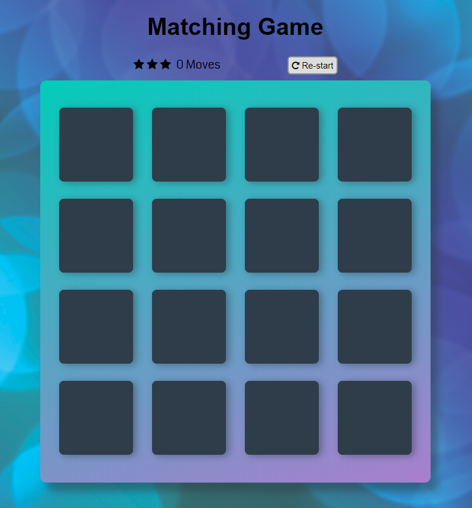
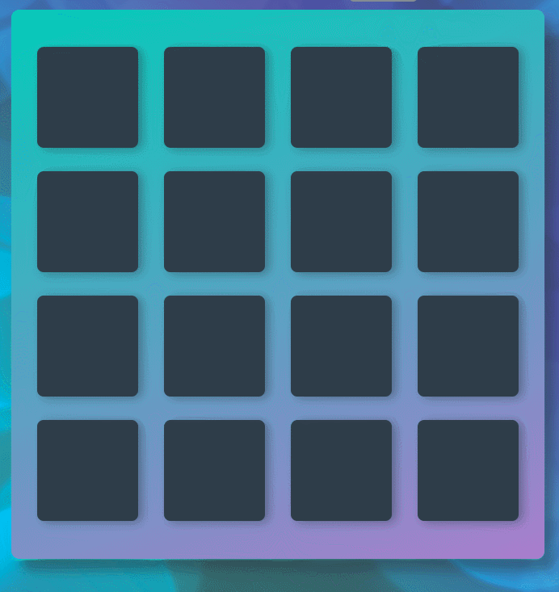
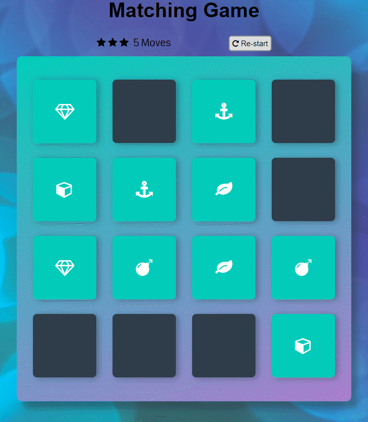

# Brain-Smart
Brain-Smart is a game that helps in imroving memory and is a great exercise for brain. There are 16 cards with 8 icons(1 icon on two cards) which are hidden and you need to match them!
## Getting Started
When the game is loaded it will display 16 plane cards. You need to click on two cards, one after the other. If the cards match they will remain open and if don't the cards will be closed immediately.

### Animated matched  and unmatched cards
When clicked cards **matched**, their color will change to dark green first and then to light green and cards will remain open later.

If cards do not **match**, they will change their color to red and get closed after a second.

### Increasing moves
Each time when pair of cards is clicked the number of __moves__  at the top of the grid will increase by one.

### Re-start the game
When all cards get matched, a pop-up will get displayed at centre of screen user needs to click __OK__  and then __re-start__ button at top of the grid of cards to play the game again.

### How to play the game
* Player needs to choose two cards at a time.
* Matched cards will remain open and unmatched will turn-over back.
* Player needs to again choose two cards to continue game.
* When all cards get matched click "Ok" on displaying alert at play again.
### Planned changes
A timer will be added. Star ratings will also be added based on the number of moves and time-taken to play the game.
### Author
Manpreet Kaur.

